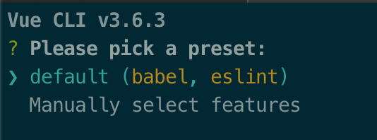
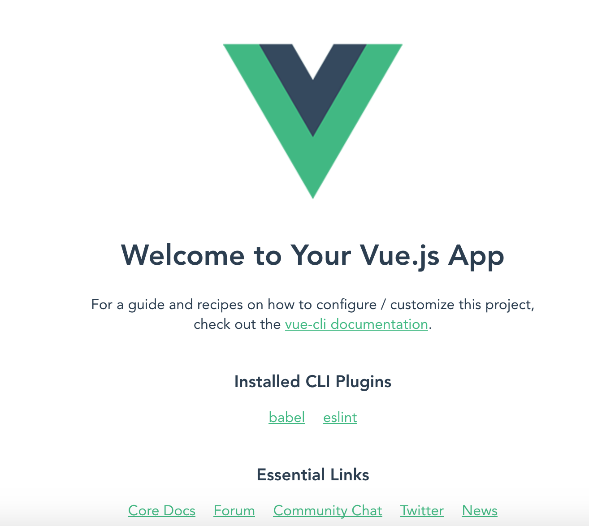

# Vue-cli

Lo primero que vamos a instalar es un cli. Un cli nos da la estructura básica de un proyecto sin que nosotros nos preocupemos de cómo debemos estructurar nuestro proyecto. Vue.js cuenta con uno muy completo, que nos deja personalizar nuestro proyecto a nuestro gusto.

Para poder instalarlo debemos abrir nuestro terminal y ejecutar la instalación, ya sea con npm o yarn, el que prefiramos.

```bash
npm install -g @vue/cli
#OR
yarn global @vue/cli
```

Durante la instalación nos dará a elegir lo siguiente:



Aquí podemos elegir que nos inicialice el proyecto con babel y eslint o podemos ir eligiendo nosotros las opciones a mano. Recomendamos la opción por defecto si no sabemos bien qué queremos exactamente.

_Babel_ es una librería que nos permitirá programar con la sintaxis de ES6 (una nueva versión de Javascript) ya que él se encargará de compilarla a ES5 por si algún navegador aún no soporta la nueva versión.

Por otra parte, _eslint_ es una librería que nos servirá para escribir código en Javascript con unas determinadas reglas. Por ejemplo podemos obligar a que no haya líneas en blanco de más, que no se nos permita dejar _console.log()_ en el código y muchas más cosas.

Una vez instalado, podremos crear un proyecto con una sola línea

`vue create webpack tutorial-vue`

## Creación de un proyecto

Una vez instalado `vue/cli` ahora podremos crear nuestro proyecto

```bash
vue create tutorial-vue
```

Si queremos lanzar el proyecto para verlo en nuestro navegador

```bash
cd tutorial-vue
yarn serve
```

Si entramos en `http://localhost:8080` deberíamos de tener la siguiente pantalla



Ya tenemos nuestra estructura básica y estamos listo para aprender mucho más de Vue.js!
